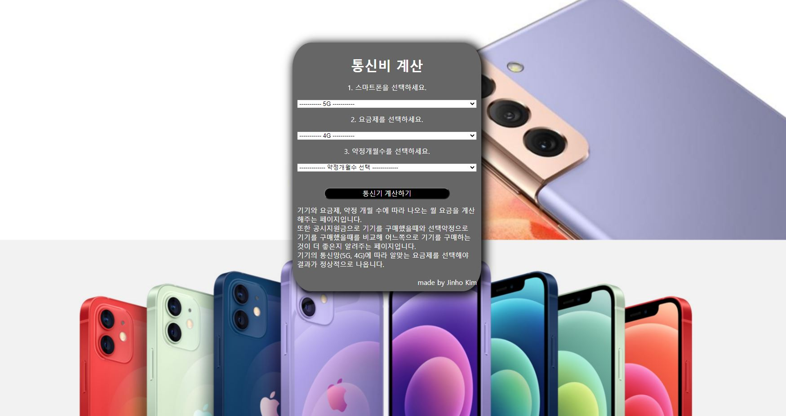
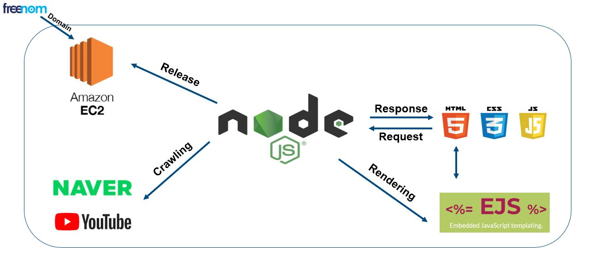

# YourSampple

[SAMSUNG](https://www.samsung.com/sec/)과 [APPLE](https://www.apple.com/)의
단어가 합쳐진 [YourSampple](https://www.yoursampple.tk:23023/)은 
당신이 알고 싶은 모든 것에 해답을 제공해줍니다!

[View Demo](https://www.yoursampple.tk:23023/) 


QRCode: 


[View Presentation](opensw-oss.pptx)


## About the project

YourSampple은 사용자에게 두가지 솔루션을 제공합니다.
samsung, lg, apple에서 제공하는 다양한 IT기기 정보를 제공해주며,
한곳의 장소에서 각종 포털에서 최신 전자기기 뉴스를 접할 수 있습니다.
추가로 유튜브를 통해 사용자의 생생한 사용후기도 들을 수 있습니다!

뿐만 아니라, 통신사에 직접 가서 요금제를 확인하기 전에, 다양한 요금제를
적용하여 최적의 요금제를 선택할 수 있습니다!

## User Interface




## Quick Start Guide

### 준비물

[Nodejs](https://nodejs.org/)

### 준비 절차

(1) Git Cloning: git bash를 열어 설치하고자 하는 디렉토리에서 다음의 코드를 실행합니다.
```shell
$ git clone http://khuhub.khu.ac.kr/2018102185/YourSampple.git
```

(2) Install npm packages: ./YourSampple/ 의 위치에서 다음의 코드를 실행합니다.
```shell
$ npm install
```

### 로컬환경에서 호스팅 시작하기

위 절차가 마무리 된다면, 아래의 코드를 입력하세요.

```shell
$ node server-local.js
```
이후 주소창에 [localohst:23023](localhost:23023)을 입력하시면 접속할 수 있습니다.

## Built with
* HTML, CSS, Javascript
* [Express](https://github.com/expressjs/express)
* [Node-cron](https://github.com/kelektiv/node-cron)
* [Cheerio](https://github.com/cheeriojs/cheerio)
* [Ejs](https://github.com/mde/ejs)
* [AWS EC2](https://aws.amazon.com/ec2)


## Project Architecture


## Contributor
* 컴퓨터공학과 2018102185 김진호
* 컴퓨터공학과 2020105641 이규성
